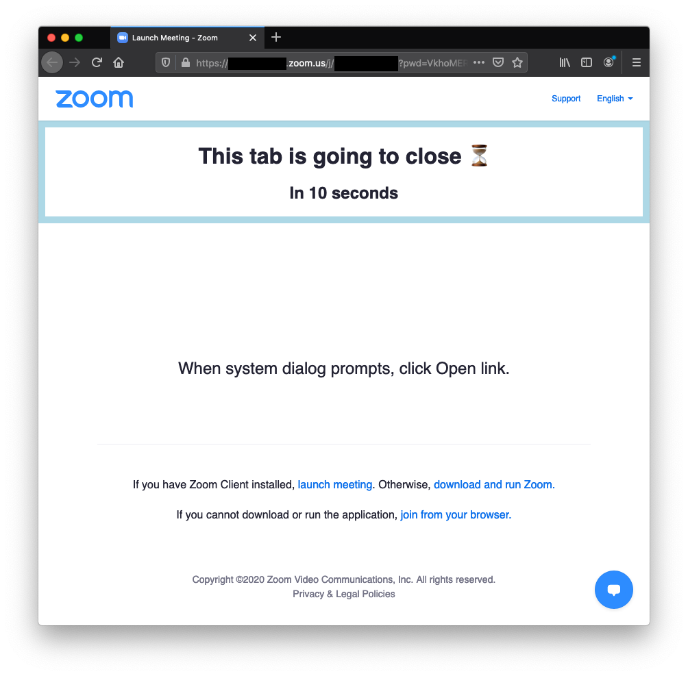

# Kazoom

Automatically close your [Zoom](https://zoom.us/) tabs after successfully triggering the app.

## In detail

This is a Firefox Add-on which closes tabs open on Zoom's website after 10 seconds. This should give you enough time to open the meeting on the app. If you go to meetings on your browser, then this won't be for you (unless you want to stick around for just 10 seconds :joy:).

:sparkles: This is for you if:

- You use Firefox
- You use the Zoom app for meetings
- You're tired of having tabs filling space that were used just to open the meeting on the app

This is pretty much it :blue_heart:

## Caveats

- You cannot cancel the timer.
- 10 seconds timeout is not configurable.
- The tab will be closed if the domain is `zoom.us`. This means that even on Zoom's main page the tab will be closed.
  - Because I don't have a problem with that (and because I'm lazy...), I'm gonna let it be for now. I don't think the fix would be complex, but it would be unnecessary for my use case. Anyhow, I'm happy to make it more pleasant for the community.

## Technical details

First of all, a disclaimer.
This is implemented towards my usage. I'm happy to make it more usable for others. So, don't be shy and give your ideas/contributions.

This add-on is split in two main files: [content_script.js](./content_script.js) and [background_script.js](./background_script.js).

[content_script.js](./content_script.js) displays the banner. It receives a number indicating the time and displays it. It will only display on the domain `zoom.us`. Whenever you open Zoom's website, it will send a message to the other script signaling where it is and it'll start receiving a message once a second.

[background_script.js](./background_script.js) stores the time it received the first message from the other script. On each second it sends the time missing to close the tab. Once it is due, the tab is closed.

## Related

What I've found is only available on Chrome (I have not tested any of them). Here's the list:

- https://github.com/seanstar12/zoom-close
- https://github.com/thesephist/clozoom
